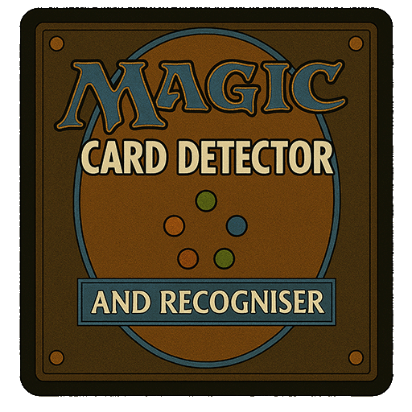
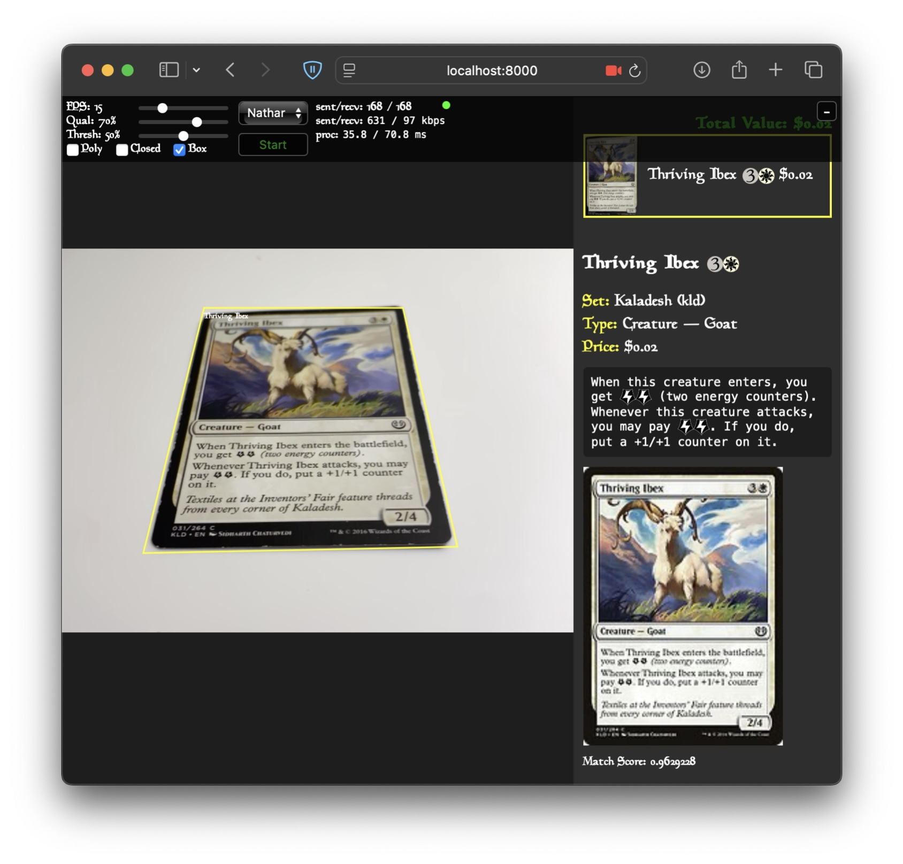
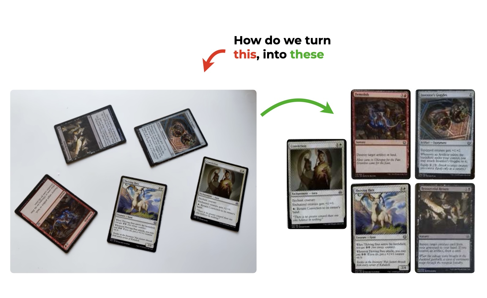
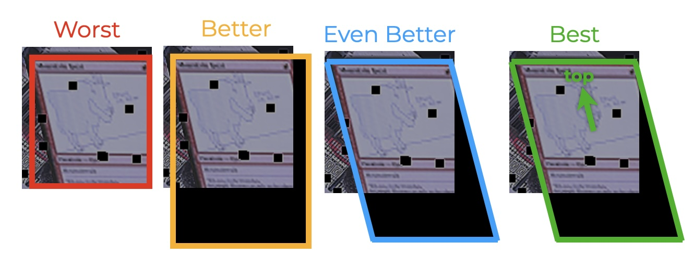
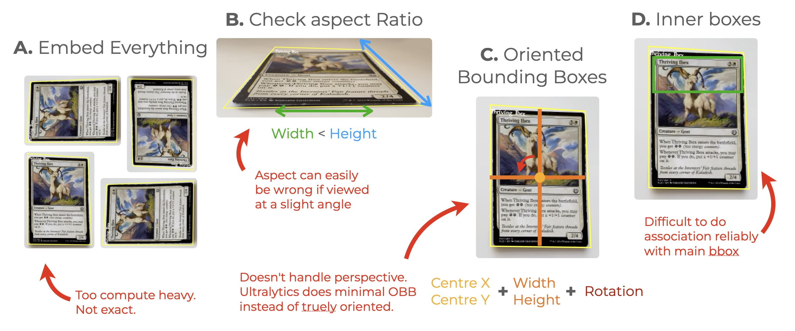
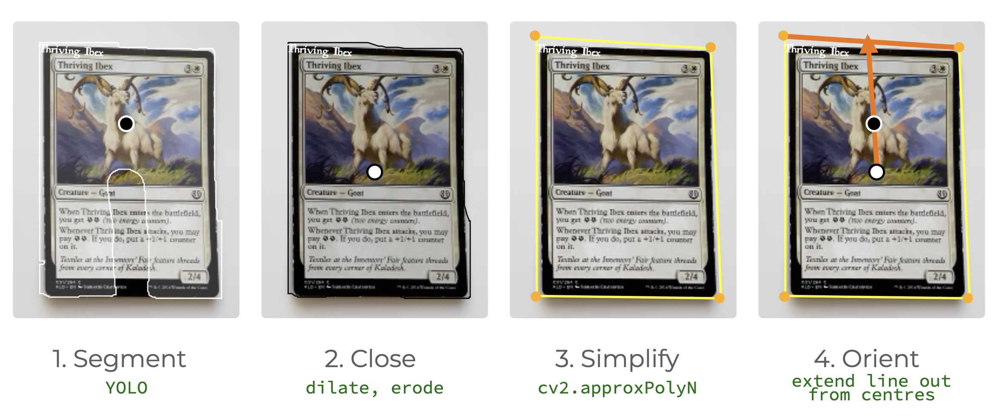
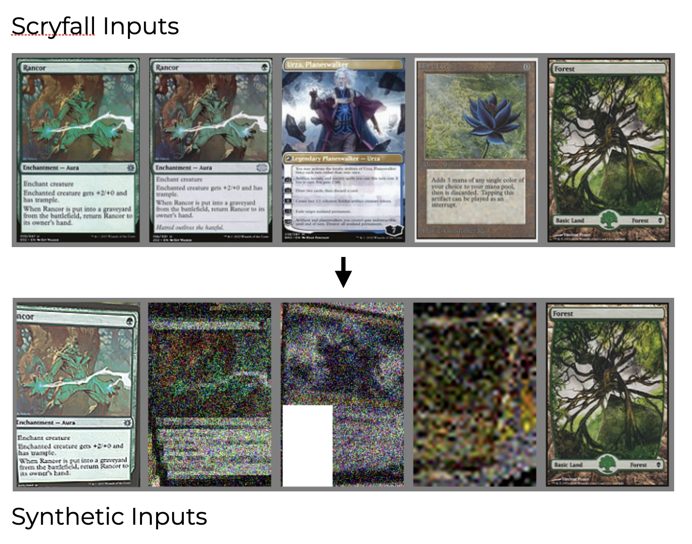
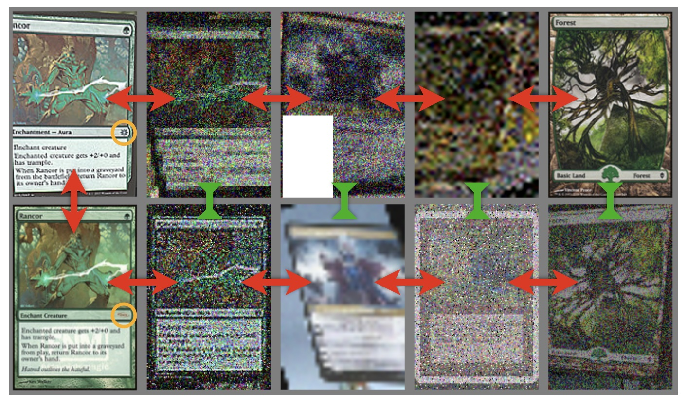
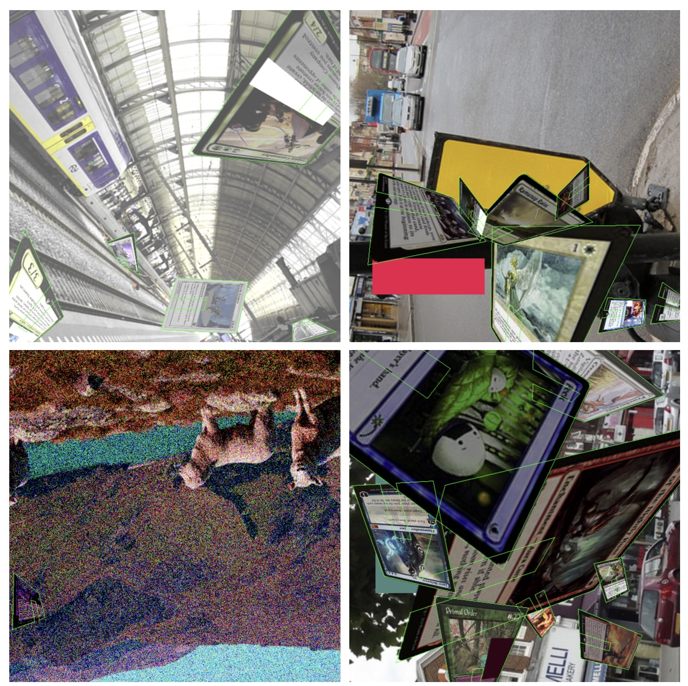
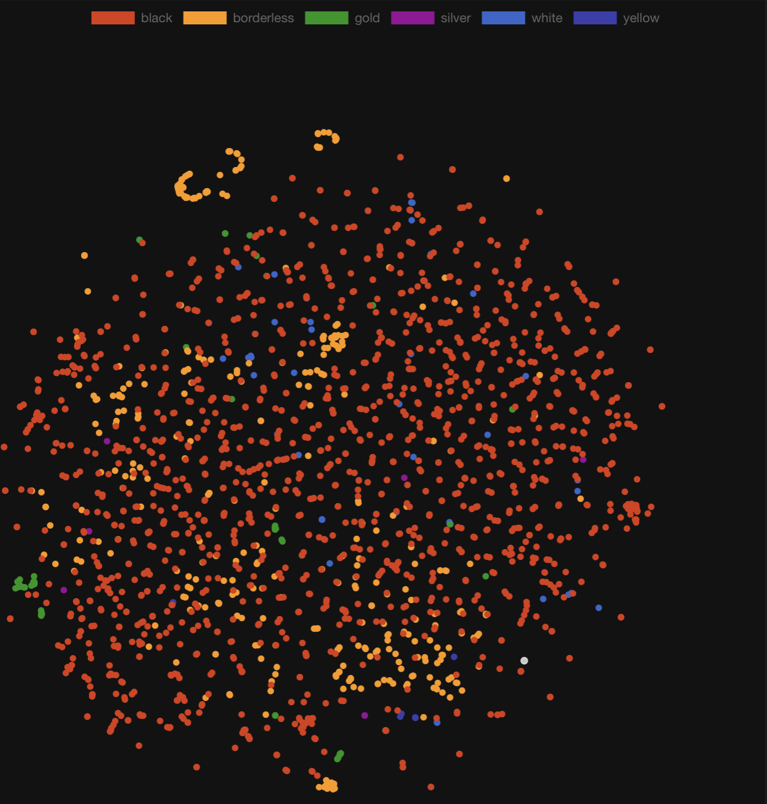

<p align="center">
    <h1 align="center">✨🔮 MTG Vision 🧙🪄</h1>
    <p align="center">
        <i>Real-time MTG card recognition</i>
    </p>
</p>

<p align="center">
    <a href="https://choosealicense.com/licenses/mit/" target="_blank">
        
    </a>
    <a href="https://pypi.org/project/mtgvision" target="_blank">
        
    </a>
    <a href="https://pypi.org/project/mtgvision" target="_blank">
        
    </a>
    <a href="https://github.com/nmichlo/mtg-vision/actions/workflows/python-test.yml">
        
    </a>
    <a href="https://codecov.io/gh/nmichlo/mtg-vision/">
        
    </a>
</p>

<p align="center">
    <p align="center">
        <a href="https://github.com/nmichlo/doorway/issues/new/choose">Contributions</a> are welcome!
    </p>
</p>

<p align="center">
    
</p>

----------------------

# MTG Vision

<p align="center">

</p>

<p align="center">
<video src="docs/mtgvision-short-demo.mp4" width="512" controls></video>
</p>

## Components

1. Data scraping (`doorway` + `mtgdata`)
   - [x] mtg card image & info scraping
     - [x] dump images to hdf5
     - [x] dump info to duckdb/dolt?

2. live view
   - [x] UI
   - [x] mtg card detection
     - [x] detection tracking
     - [x] camera tracking for detection overlay stabilisation
   - [x] mtg card recognition
     - [x] Vector database (Qdrant)

3. model training
    - [x] mtg card detection/segmentation
      - [x] augmented data generation
      - [x] model definition
      - [x] model training
    - [x] mtg card embedding model (recognition)
      - [x] augmented data generation
      - [x] model definition
      - [x] model training
    - [ ] combined model (`rf-detr` if it ever supports segmentation + custom embedding output extensions? Unified model?)
      - [ ] model definition
      - [ ] model training

--------------

## Overview

### Obtaining Data

All data is collected from Scryfall using the `mtgdata` python package
as well as `doorway` for image downloads.

### Card Orientation

<p align="center">

</p>


**Bounding Box Requirements**
1. the worst is standard bounding boxes showing only visible regions
2. slightly better is standard bounding boxes predicting the entire card
3. even better is minimal oriented bounding boxes (e.g. ultralytics OBB, doesn't do true 360deg orientation)
4. best is truly oriented POLYGONS not bounding boxes so we can handle perspective too.

<p align="center">

</p>

**Orientation approaches that don't work**

<p align="center">

</p>

**Hack for oriented bounding boxes**
1. Use segmentation but with a cutout at the bottom so we can get the card orientation
2. Dilate then erode (close) the segmentation polygon to remove the cutout
3. Simplify the polygon to get corners using `cv2.approxPolyN` with `N=4`
4. Take the center of mass of the cutout polygon and the closed polygon and draw a line through them extending to the simplified polygon to find the top and orientation.

<p align="center">

</p>

### Data - Embedding Model Inputs & Batch Formation

**Generating random input images from scryfall images**

- this is used as inputs to train the embedding model `ConvNeXt V2`

<p align="center">

</p>

**Form batch of images for training**
- We use `CircleLoss` from `pytorch-metric-learning` which requires a batch of images
  with positive and negative pairs. The positive pairs are images of the same card and the negative
  pairs are images of different cards.
- The batch is formed by randomly sampling images from the dataset and then augmenting them
  with random transformations, TWICE, to get the positive pairs. The negative pairs are
  just all other images in the batch.
- We also need to do hard-negative mining so we randomly swap out some cards with cards of the
  same name, so that the model learns to distinguish minor differences like set code.

<p align="center">

</p>

### Data - Detection Model Inputs

- Forming the detection dataset is done in a very similar way to the embedding model
  inputs, however, we need to also augment and transform the bounding boxes along with
  the cards and as they are warped onto the images.
- Cards are placed and warped randomly onto random background images using rejection sampling.
  If cards overlap too much, then we retry for another placement.

<p align="center">

</p>

### Matching - Qdrant

1. All cards are embedded and stored in Qdrant
2. When a card is detected, we get the embedding and search
   Qdrant for the closest match and retrieve the card information
   which is stored as a payload alongside the vector.

**Example embedding visualisation - Colored by card `border_color`**

<p align="center">

</p>

### Demo

The demo application consists of
- fastapi websocket server for receiving images, running detection, tracking with `norfair` and finally
  embedding and searching Qdrant for the closest match.
- websocket client written in typescript using `lit html`, sends images from a webcam over websockets and displays
  results and matched card information in an SVG overlay over the video.

<p align="center">

</p>

**Run the demo**

1. start qdrant ([quickstart](https://qdrant.tech/documentation/quickstart/))

   ```bash
   docker run -p 6333:6333 -p 6334:6334 \
       -v "$(pwd)/qdrant_storage:/qdrant/storage:z" \
       qdrant/qdrant
   ```

2. install deps

   ```bash
   # install python deps
   conda create -n mtg-vision python=3.12
   pip install -e ./

   # install node 22 with nvm, and install pnpm, and install deps
   nvm install 22
   nvm use 22
   npm install -g pnpm
   cd "mtg-vision/www"
   pnpm install
   ```

3. prepare

   ```bash
   # populate qdrant
   python -m mtgvision.qdrant_populate

   # other
   # $ python -m mtgvision.encoder_train
   # $ python -m mtgvision.encoder_export
   # $ python -m mtgvision.od_datasets  # generate dataset for yolo
   # $ python -m mtgvision.od_train
   # $ python -m mtgvision.od_export
   ```

4. start the server

   ```bash
   cd "mtg-vision"
   fastapi dev mtgvision/server.py --host 0.0.0.0
   ```

5. start the client

   ```bash
   cd ./www
   pnpm install
   pnpm start
   ```

5. expose for mobile device testing (which require https)

   install cloudflared / cloudflare tunnel [here](https://developers.cloudflare.com/cloudflare-one/connections/connect-networks/downloads/)

   ```bash
   cloudflared tunnel --url http://localhost:8000
   ```


--------------

<p float="left" align="center">
    <a href="https://github.com/nmichlo/doorway">
        
    </a>
    &nbsp;&nbsp;
    <a href="https://github.com/nmichlo/mtg-dataset">
        
    </a>
    &nbsp;&nbsp;
    <a href="https://github.com/nmichlo/mtg-vision">
        
    </a>
</p>
